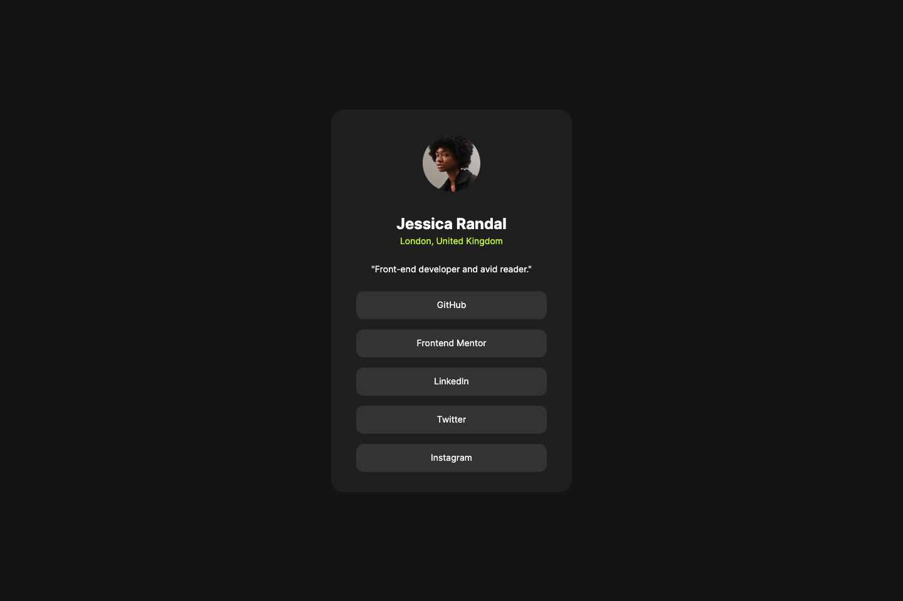

# Frontend Mentor - Social links profile solution

This is a solution to the [Social links profile challenge on Frontend Mentor](https://www.frontendmentor.io/challenges/social-links-profile-UG32l9m6dQ). Frontend Mentor challenges help you improve your coding skills by building realistic projects.

## Table of contents

- [Overview](#overview)
  - [The challenge](#the-challenge)
  - [Screenshot](#screenshot)
  - [Links](#links)
- [My process](#my-process)
  - [Built with](#built-with)
  - [What I learned](#what-i-learned)
  - [Continued development](#continued-development)
  - [Useful resources](#useful-resources)
- [Author](#author)

## Overview

### The challenge

Users should be able to:

- See hover and focus states for all interactive elements on the page

### Screenshot



### Links

- Solution URL: [https://bdeweer.github.io/social-links-profile/](https://bdeweer.github.io/social-links-profile/)
- Live Site URL: [https://bdeweer.github.io/social-links-profile/](https://bdeweer.github.io/social-links-profile/)

## My process

### Built with

- Pure HTML
- Pure CSS
- Media Queries
- No Flex
- No Grid

**Note: These are just examples. Delete this note and replace the list above with your own choices**

### What I learned

Une div est un élément de type block. Quoi qu'il arrive, on passera à la ligne si on en place deux côte à côte.
Une span est un élément de type inline. Il prend le moins d'espace possible.
Un élément inline ne prendra jamais en considération les largeurs et hauteurs définies dessus.

margin:auto positionne une div au centre

Privilégier rem a em

```css
:root {
  --grey-700: hsl(0, 0%, 20%);
  --grey-800: hsl(0, 0%, 12%);
  --grey-900: hsl(0, 0%, 8%);
  --green: hsl(75, 94%, 57%);
  --white: hsl(0, 0%, 100%);
  --line-height: 150%;
  --letter-spacing: 0px;
  --spacing-500: 40px;
  --spacing-300: 24px;
  --spacing-200: 16px;
  --spacing-150: 12px;
  --spacing-100: 8px;
  --spacing-50: 4px;
}
```

### Continued development

Now I would like to learn more about CSS Grid and Flex positioning.

### Useful resources

- [HSL Color picker](https://colorpicker.dev) - An online cool color picker
- [VS Code tip](https://www.kevinpowell.co/article/change-from-hex-to-rgb-to-hsl-in-seconds-with-vs-code/) - A guide explaining how to switch from HEX to RGB to HSL in seconds with VS Code.

## Author

- Website - [Bertrand Deweer](https://www.your-site.com)
- Frontend Mentor - [@bdeweer](https://www.frontendmentor.io/profile/bdeweer)
- Twitter - [@bdeweeronx](https://x.com/bdeweeronx)
